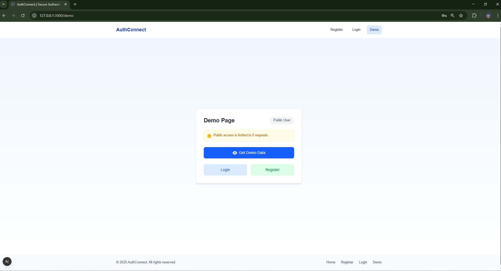

# AuthConnect

## Overview

AuthConnect is a proof of concept (POC) project demonstrating a modern authentication system with tiered access control. It showcases a practical implementation of user authentication that differentiates between public and authenticated users.

### Key Features

- **Dual Access Modes**:
  - **Public Access**: Allows unauthenticated users limited access based on IP address tracking
  - **Private Access**: Provides unlimited access to authenticated users

- **Request Limit System**:
  - Tracks public users by IP address
  - Limits public users to 5 requests before requiring registration
  - Shows remaining requests to encourage conversion

- **Security Implementation**:
  - JWT token-based authentication
  - Password hashing with bcrypt
  - Protected routes with token verification

### Technology Stack

- **Frontend**: Next.js with Tailwind CSS
- **Backend**: FastAPI (Python)
- **Database**: SQLite for development
- **Authentication**: Custom JWT implementation

This project serves as a demonstration of how to implement a common real-world pattern where services offer limited functionality to anonymous users while encouraging account creation for full access.


## Installation

### Clone the Repository

To get started with AuthConnect, clone the repository from GitHub:

```bash
# Clone the repository
git clone https://github.com/NoManNayeem/AuthConnect.git

# Navigate to the project directory
cd AuthConnect
```

The repository contains both the frontend (Next.js) and backend (FastAPI) applications structured as follows:

```bash
AuthConnect/
├── authconnect-frontend/  # Next.js application
├── authconnect-backend/   # FastAPI application
├── screenshots/           # Project screenshots
├── .gitignore
└── README.md
```

## Running Locally

AuthConnect consists of two applications that need to be run separately:

### Backend Setup (FastAPI)

1. **Create and activate a virtual environment:**

   ```bash
   cd authconnect-backend
   python -m venv venv
   
   # Windows
   venv\Scripts\activate
   
   # macOS/Linux
   source venv/bin/activate
    ```

2. Install dependencies:
```bash
pip install -r requirements.txt
```
3. Run the FastAPI server:
```bash
uvicorn main:app --reload
```
The backend will run on `http://127.0.0.1:8000`


### Frontend Setup (Next.js)
1. Install dependencies:
```bash
cd authconnect-frontend
npm install
```
2. Set up environment variables:
- Create or update `.env.local` file:
```bash
NEXT_PUBLIC_API_URL=http://127.0.0.1:8000
```
3. Run the development server:
```bash
npm run dev
```
The frontend will run on http://localhost:3000


### Accessing the Application
Once both servers are running:
- Access the application at http://localhost:3000
- Register a new user account
- Login with your credentials
- Explore the demo page with authenticated access


## Screenshots

Below are screenshots showing the key features and interfaces of AuthConnect. The images demonstrate both public and private access modes, authentication flows, and the request limit system in action.

<div class="screenshot-grid">
  <div class="screenshot-item">
    
    <p>Home Page - Landing screen for all users</p>
  </div>
  <div class="screenshot-item">
    
    <p>Registration Form - Create a new account</p>
  </div>
  <div class="screenshot-item">
    
    <p>Login Page - Authentication interface</p>
  </div>
  <div class="screenshot-item">
    
    <p>Public Access - Limited functionality for anonymous users</p>
  </div>
  <div class="screenshot-item">
    
    <p>Request Limit Warning - Public user approaching limit</p>
  </div>
  <div class="screenshot-item">
    
    <p>Access Restricted - Public user reached limit</p>
  </div>
  <div class="screenshot-item">
    
    <p>Private Access - Full functionality for registered users</p>
  </div>
  <div class="screenshot-item">
    
    <p>Private Access</p>
  </div>
  <div class="screenshot-item">
    
    <p>API Docs - FastAPI Swagger Docs interface</p>
  </div>
</div>

<style>
.screenshot-grid {
  display: grid;
  grid-template-columns: repeat(auto-fill, minmax(300px, 1fr));
  gap: 20px;
  margin: 30px 0;
}

.screenshot-item {
  border: 1px solid #e0e0e0;
  border-radius: 8px;
  overflow: hidden;
  box-shadow: 0 4px 6px rgba(0, 0, 0, 0.1);
  transition: transform 0.3s ease;
}

.screenshot-item:hover {
  transform: translateY(-5px);
}

.screenshot-item img {
  display: block;
  width: 100%;
  height: auto;
  object-fit: cover;
}

.screenshot-item p {
  padding: 10px;
  margin: 0;
  background-color: #f8f9fa;
  font-size: 14px;
  text-align: center;
}

@media (max-width: 768px) {
  .screenshot-grid {
    grid-template-columns: repeat(auto-fill, minmax(250px, 1fr));
  }
}

@media (max-width: 480px) {
  .screenshot-grid {
    grid-template-columns: 1fr;
  }
}
</style>


## Author

### Noman Nayeem
- **GitHub**: [NoManNayeem](https://github.com/NoManNayeem)
- **Project Repository**: [AuthConnect](https://github.com/NoManNayeem/AuthConnect.git)

AuthConnect was developed as a proof of concept to demonstrate modern authentication patterns and access control based on user status. The project showcases practical implementation of IP-based request limiting for public users while providing full access to authenticated users.

Feel free to contribute to this project by submitting pull requests or opening issues on the GitHub repository.